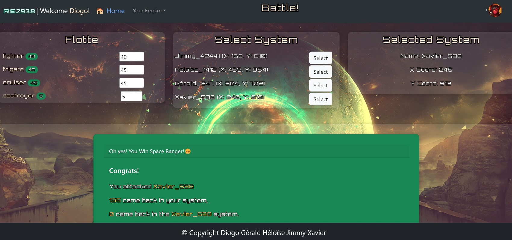
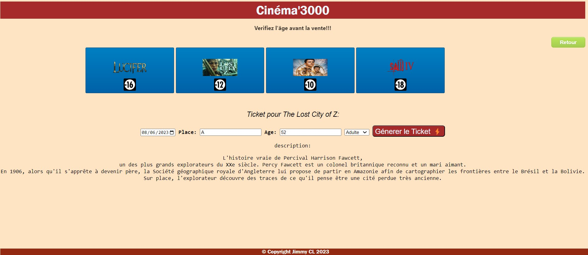
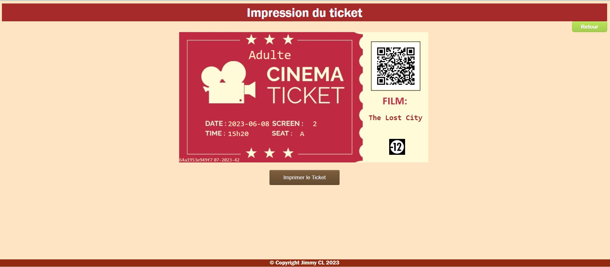

<!-- Main -->

<!-- One -->
<section id="one">
	

		<header class="major">
			<h2>Mes Projets</h2>
		</header>
		
En tant qu'étudiant en développement web, j'ai entrepris plusieurs projets pour acquérir des compétences en PHP, JavaScript  HTML/CSS ainsi que  des framework comme Laravel, Réact. Ces langages de programmation sont essentiels pour créer des sites web dynamiques et interactifs. Mon objectif est de continuer à développer mes compétences et d'explorer de nouvelles technologies afin de créer des expériences en ligne convaincantes et intuitives. 

	

</section>

<!-- Two -->

<section id="two" class="spotlights">
<section >
		

				

					

					

					

					

				

		

		

			

				<header class="major">
					<h3>Renegade Salvation</h3>
				</header>
				<blockquote>Avant projet Final du titre Pro, en utilisant PHP, Javascript, Mysql, Frameworks laravel et React. Utilisation de Stripe également.
				Le projet était de creer un jeu MMORPG de bataille de vaisseaux entre système galactique.
				</blockquote>
				<ul class="actions">
					<li>
						<a href="https://github.com/Jimbow-cl/RENEGADE_SALVATION_2938_front" class="button">Lien GitHub Front
							
								
							
						</a>
					</li>
					<li>
						<a href="https://github.com/Jimbow-cl/RENEGADE_SALVATION_2938_back" class="button">Lien GitHub Back
							
								
							
						</a>
					</li>
				</ul>
			

		

</section>
<section >
		

				

					

					<!-- Break -->
					

				

		

		

			

				<header class="major">
					<h3>Web-Woof</h3>
				</header>
				<blockquote>L'objectif de ce de projet est de développer un blog avec posts, commentaires, likes, users, tout en utilisant le modèle MVC = Laravel. Les images sont stockées et détruit directement sur le serveur.
				Il est possible de créer la Base Mysql, via une migration</blockquote>
				<ul class="actions">
					<li>
						<a href="https://github.com/Slam85/web_woof" class="button">Lien GitHub 
							
								
							
						</a>
					</li>
				</ul>
			

		

</section>
	<section >
		

				

					

					<!-- Break -->
					

					

					

					

				

		

		

			

				<header class="major">
					<h3>Close But No Car</h3>
				</header>
				<blockquote>L'objectif de ce de projet est de développer un site de vente aux enchères de voitures d'occasions en PHP avec MySQL en binôme. Inscription, Création d'annonce, Liaison de Table, Modification du profil, Possibilité d'enchèrire sur d'autres annonces etc... </blockquote>
				<ul class="actions">
					<li>
						<a href="https://github.com/heloisebaillet/CloseButNoCar" class="button">Lien GitHub 
							
								
							
						</a>
					</li>
				</ul>
			

		

	</section>
	<section >
		

				

					

					<!-- Break -->
					

				

		

		

			

				<header class="major">
					<h3>E-commerce</h3>
				</header>
				<blockquote>L'objectif de ce de projet est de développer un site de E-commerce en PHP avec l'utilisation de namespace, de classes, d'objets, méthodes statiques  .</blockquote>
				<ul class="actions">
					<li>
						<a href="https://github.com/Jimbow-cl/Ecommerce" class="button">Lien GitHub 
							
								
							
						</a>
					</li>
				</ul>
			

		

	</section>
	<section >
		

				

					

					<!-- Break -->
					

				

			

		

			

				<header class="major">
					<h3>Le guichet</h3>
				</header>
				<blockquote>L'objectif de ce de projet est de développer un site de vente de place de Cinéma et de Théatre, en PHP. Le 	site est donc l'IHM du vendeur. Verification de l'âge du client,résumé des films, génération de QR code, d'ID unique
				</blockquote>
				<ul class="actions">
					<li>
						<a href="https://github.com/Jimbow-cl/Guichet" class="button">Lien GitHub 
							
								
							
						</a>
					</li>
				</ul>
			

		

	</section>
	<section>
		

				

					

					<!-- Break -->
					

				

		

		

			

				<header class="major">
					<h3>The Blhook</h3>
				</header>
				<blockquote>The Blhook pour "Book" "Blog" et "Hook". Projet d'un mini réseau social utilisant Javascript avec le Framework Réact, ainsi que plusieurs API Rest. </blockquote>
				<ul class="actions">
					<li>
						<a href="https://github.com/Jimbow-cl/Blhook" class="button">Lien GitHub 
							
								
							
						</a>
					</li>
				</ul>
			

		

	</section>
		<section>
			

				

					

					<!-- Break -->
					

				

			

		

			

				<header class="major">
					<h3>Le café de la Place</h3>
				</header>
				<blockquote>Création d’un site en équipe utilisant Javascript Vanilla. 
				Le but étant de créer un module de gestion de stock à la fois pour le gestionnaire et pour un utilisateur classique.
				</blockquote>
				<ul class="actions">
					<li>
						<a href="https://github.com/Jimbow-cl/cafe-de-la-place" class="button">Lien GitHub 
							
								
							
						</a>
					</li>
				</ul>
			

		

	</section>
	<section>
			

				

					<!-- Break -->
					

					

					<!-- Break -->
					

				

			

		

			

				<header class="major">
					<h3>Adventure Wind</h3>
				</header>
				<blockquote>Création d’un Projet HTML / CSS en respectant une maquette imposée par le client. Deux projets, un en Bootstrap, un en Flex</blockquote>
				<ul class="actions">
					<li>
						<a href="https://github.com/Jimbow-cl/AdventureWind-Bootstrap" class="button">GitHub Bootsrap 
							
								
							
						</a>
					</li>
					<li>
						<a href="https://github.com/Jimbow-cl/AdventureWind-Flex-" class="button">Lien GitHub Flex 
							
								
							
						</a>
					</li>
				</ul>
			

		

	</section>
</section>

